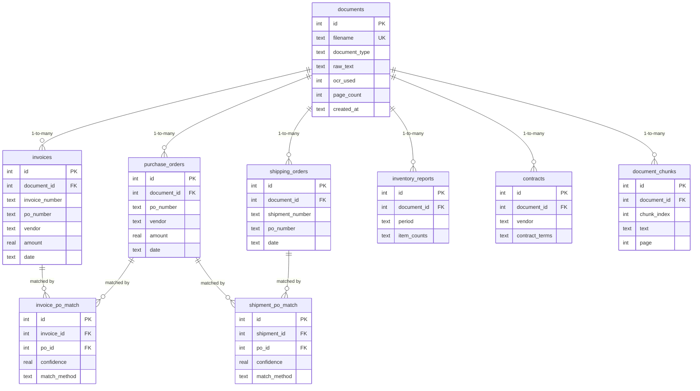
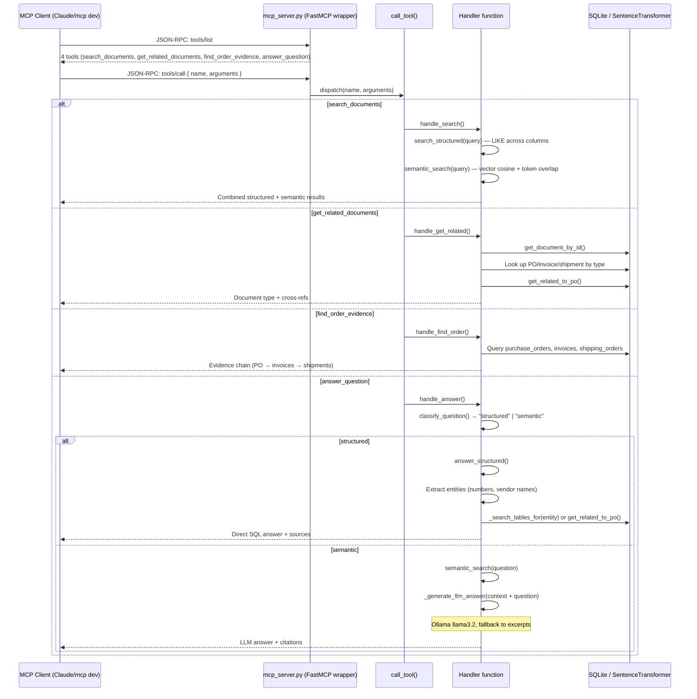
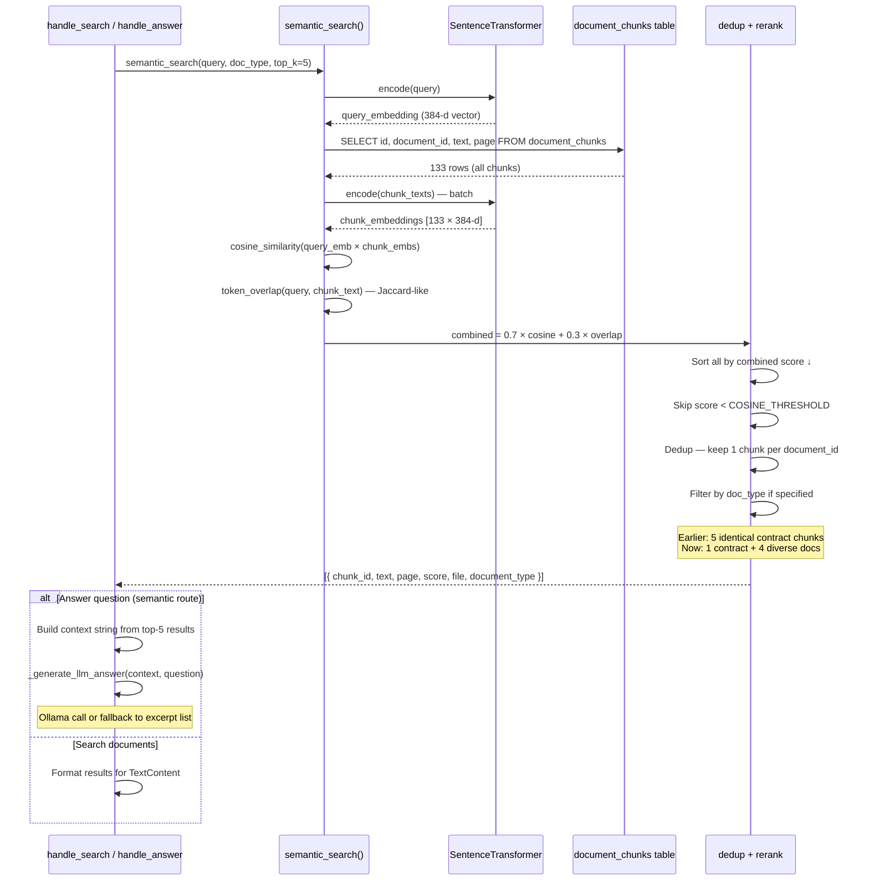
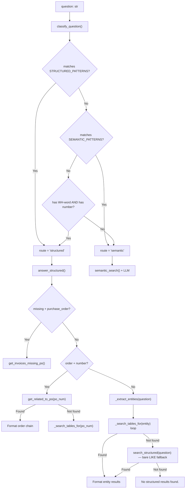
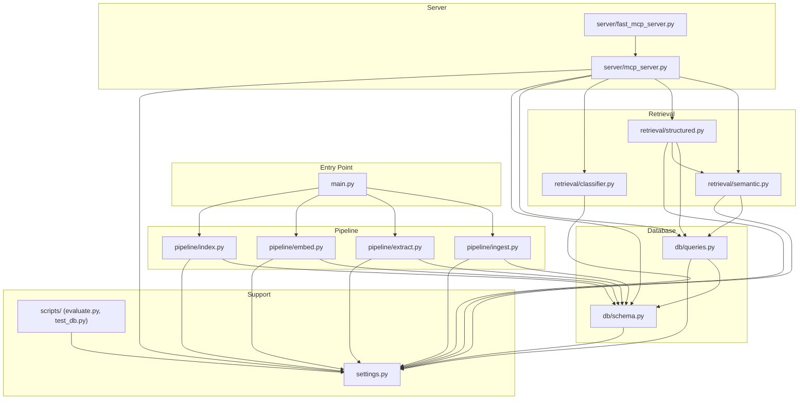

# System Diagrams

## 1. Entity-Relationship Diagram



---

## 2. Pipeline Flow (Ingestion → Extraction → Embedding → Indexing)

```mermaid
sequenceDiagram
    participant FS as data/ dir
    participant Ingest as ingest.py
    participant DB as SQLite
    participant Extract as extract.py
    participant Embed as embed.py
    participant Index as index.py

    Ingest->>FS: Walk subdirs (invoices/, purchase_orders/, ...)
    Ingest->>Ingest: Classify by subdir name
    
    loop Each file
        Ingest->>Ingest: OCR (jpg/png) or PyMuPDF (pdf)
        Ingest->>DB: INSERT OR IGNORE INTO documents
        Ingest->>DB: SELECT id (existing or new)
    end

    Ingest-->>Extract: 45 documents ingested

    Extract->>DB: SELECT all documents
    
    loop Each document
        Extract->>Extract: Dispatch to parser by doc_type
        Extract->>Extract: Regex extraction (invoice#, vendor, PO#, amounts...)
        Extract->>DB: INSERT OR IGNORE INTO type-specific table
    end

    Extract-->>Embed: Structured data extracted

    Embed->>DB: SELECT documents (ordered by id)
    
    loop Each document
        Embed->>Embed: chunk_text() — split by paragraphs, ~512 chars
        Embed->>Embed: SentenceTransformer encode(chunks)
        Embed->>DB: INSERT INTO document_chunks
    end

    Embed-->>Index: 133 chunks in DB

    Index->>DB: Match invoices → POs by po_number
    Index->>DB: Match shipments → POs by po_number
    Index->>DB: Fallback match by vendor+amount similarity
    Index->>DB: INSERT INTO invoice_po_match / shipment_po_match

    Index-->>: Pipeline complete (5 cross-refs)
```

---

## 3. MCP Tool Dispatch



---

## 4. Semantic Search Internals



---

## 5. Classifier Routing Logic



---

## 6. File Layout and Module Dependencies


